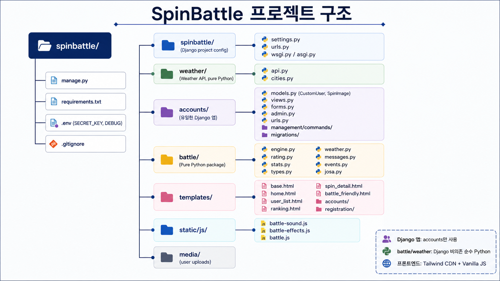

# SpinBattle

**웹서버컴퓨터** 과목 프로젝트 — 이미지를 팽이로 만들어 대전하는 웹 게임

---

## 개요

이미지를 업로드하면 SHA-256 해시 기반으로 자동 스탯·타입이 부여되는 팽이가 생성되고, 다른 유저의 팽이와 랭크/친선 대전을 할 수 있습니다.

- **프레임워크**: Django 5.x
- **프론트엔드**: Tailwind CSS (CDN), Vanilla JavaScript
- **데이터베이스**: SQLite (개발용)
- **외부 API**: Open-Meteo (날씨, API 키 불필요)
- **Python**: 3.12 이상

---

## 프로젝트 구조

```
spinbattle/
├── manage.py
├── requirements.txt
├── .env                        # 환경 변수 (gitignored)
├── spinbattle/                 # Django 프로젝트 설정
│   ├── settings.py
│   ├── urls.py
│   └── wsgi.py / asgi.py
├── accounts/                   # 유저 & 팽이 앱
│   ├── models.py               # CustomUser, SpinImage
│   ├── views.py                # 모든 뷰
│   ├── forms.py
│   ├── urls.py
│   └── admin.py
├── battle/                     # 전투 로직 (순수 Python, Django 비의존)
│   ├── engine.py                # 전투 시뮬레이션
│   ├── stats.py                 # 스탯 계산
│   ├── types.py                 # 타입 상성
│   ├── rating.py                # ELO 레이팅
│   ├── weather.py               # 날씨 효과 상수
│   ├── messages.py              # 전투 메시지 다국어
│   ├── events.py                # 랜덤 이벤트 데이터
│   └── josa.py                  # 한국어 조사 처리
├── weather/                    # 날씨 API (순수 Python)
│   ├── api.py                  # Open-Meteo 연동 (30분 캐시)
│   └── cities.py               # 도시 목록
├── templates/                  # 프로젝트 템플릿
├── static/js/                  # 프론트엔드 JS
├── locale/                     # 번역 파일 (ko/ja/en)
└── docs/diary/                 # 개발 일지
```



---

## 설치 & 실행

### 1. 저장소 클론

```bash
git clone <repo-url> spinbattle
cd spinbattle
```

### 2. 가상환경 생성 & 활성화

```bash
python -m venv venv
source venv/bin/activate   # macOS/Linux
# venv\Scripts\activate    # Windows
```

### 3. 의존성 설치

```bash
pip install -r requirements.txt
```

| 패키지 | 버전 | 용도 |
|---|---|---|
| Django | 5.1+ | 웹 프레임워크 |
| python-dotenv | 1.0+ | `.env` 파일 로드 |
| Pillow | 10.0+ | 이미지 처리 (타입 분석) |
| requests | 2.31+ | Open-Meteo 날씨 API 호출 |

### 4. 환경 변수 설정

`.env` 파일을 프로젝트 루트에 생성:

```bash
SECRET_KEY=your-secret-key-here
DEBUG=True
USE_R2_STORAGE=False
```

- `SECRET_KEY`: Django 시크릿 키 (프로덕션에서는 반드시 변경)
- `DEBUG`: `True`면 디버그 모드, `False`면 프로덕션 모드
- `USE_R2_STORAGE`: `True`면 Cloudflare R2를 미디어 저장소로 사용

R2 사용 시 아래도 함께 설정:

```bash
R2_ACCOUNT_ID=your-cloudflare-account-id
R2_BUCKET_NAME=spinbattle-media
R2_ACCESS_KEY_ID=your-r2-access-key-id
R2_SECRET_ACCESS_KEY=your-r2-secret-access-key
R2_ENDPOINT_URL=https://your-account-id.r2.cloudflarestorage.com
R2_PUBLIC_URL=https://media.your-domain.com
```

### 5. 데이터베이스 마이그레이션

```bash
python manage.py migrate
```

### 6. 관리자 계정 생성

```bash
python manage.py createsuperuser
```

### 7. 개발 서버 실행

```bash
python manage.py runserver
```

브라우저에서 `http://127.0.0.1:8000/` 접속

### 8. 임시 외부 공개(터널링, Turnkey)

`cloudflared`가 설치되어 있으면 아래 한 줄로 로컬 서버 + 외부 터널을 동시에 실행합니다.

```bash
./scripts/tunnel.sh
```

- Django는 `0.0.0.0:8000`으로 실행됩니다.
- 외부 접속 URL은 `cloudflared` 출력의 `https://*.trycloudflare.com` 주소를 사용합니다.
- 종료는 `Ctrl+C` 한 번이면 되고, Django 서버도 같이 정리됩니다.
- 실행 시 `DEBUG=False`가 강제됩니다.
- 실행 시 `ALLOWED_HOSTS`에 `.trycloudflare.com`, `CSRF_TRUSTED_ORIGINS`에 `https://*.trycloudflare.com`이 자동 반영됩니다.
- 실행 시 기본으로 슈퍼유저 임시 비밀번호를 새로 발급해 출력합니다.

필요 시 포트/호스트 변경:

```bash
PORT=9000 HOST=0.0.0.0 ./scripts/tunnel.sh
```

임시 비밀번호 발급 제어:

```bash
ISSUE_TEMP_ADMIN_PASSWORD=0 ./scripts/tunnel.sh
ADMIN_USERNAME=admin ./scripts/tunnel.sh
```

macOS에서 `cloudflared` 설치:

```bash
brew install cloudflare/cloudflare/cloudflared
```

---

## 핵심 기능

| 기능 | URL | 설명 |
|---|---|---|
| 홈 | `/` | 서비스 소개 |
| 회원가입 | `/accounts/signup/` | 유저 가입 |
| 로그인 | `/accounts/login/` | Django 내장 auth |
| 내 팽이 | `/accounts/my-spins/` | 프로필 수정 + 팽이 업로드/삭제 (최대 5개) |
| 팽이 상세 | `/accounts/spins/<pk>/` | 스탯 레이더 차트 + 대전 버튼 |
| 랭킹 | `/accounts/ranking/` | 전체 팽이 레이팅 순위표 |
| 유저 목록 | `/accounts/users/` | 유저별 총 점수 |
| 친선 대전 | `/accounts/friendly-battle/` | 도시 선택 가능 |
| 랭크 대전 | `/accounts/ranked-battle/` | 점수 근접 상대 자동 매칭, ELO 반영 |
| 대전 재생 | `/battle/` | 전투 애니메이션 재생 |

---

## 전투 시스템 요약

### 스탯

6개 스탯이 SHA-256 해시에서 결정됩니다:

| 스탯 | 영문 | 효과 |
|---|---|---|
| 초기 속도 | speed | HP + 데미지 기여 + 선제 판정 |
| 가속도 | acceleration | 가속 발동 시 속도 증가량 + 크리 배율 |
| 행운 | luck | 크리 확률 + 랜덤 이벤트 가중 + 선제 랜덤 |
| 지구력 | stamina | 턴 종료 감속 저항 |
| 공격력 | attack | 데미지 + 선제 판정 |
| 방어력 | defense | HP 보너스 + 데미지 감소율 + 감속 저항 |

### 데미지 공식

```
base_damage = attack × 0.18 + speed × 0.02
reduction  = defense / (defense + 35)
final_damage = base_damage × (1 - reduction) × type_multiplier × crit_multiplier
```

### 선제 판정

```
priority = speed × 0.6 + attack × 0.25 + defense × 0.15 ± luck × 0.3
```

### 감속 (매 턴 종료)

```
decel = 4.0 × (80 / stamina) × growth × defense_factor
growth = 1 + (turn - 1) × 0.08
defense_factor = max(1 - defense × 0.008, 0.3)
26턴부터 ×2, 31턴부터 ×4
```

### 날씨 효과

| 날씨 | 효과 |
|---|---|
| 쾌청 (clear) | fire·electric 공격 +15%, 크리 확률 +5% |
| 비 (rain) | water 속도 회복 보너스, fire 공격 -20%, 빗물 유입 이벤트 |
| 눈 (snow) | ice 방어 +20%, fire 속도 감속 +20%, 눈보라 이벤트 |
| 평범 (normal) | 없음 |

---

## 배치 매치

팽이 업로드 직후 자동으로 10판 랭크 배치 매치가 진행되어 초기 레이팅이 산출됩니다. 점수 근접 상대를 가중치로 선정하며 ELO(K=32)로 레이팅이 갱신됩니다.

---

## 다국어

한국어(ko), 일본어(ja), 영어(en)를 지원합니다. 상단바에서 언어 전환이 가능하며, 번역 파일은 `locale/` 디렉토리에 있습니다.

```bash
python manage.py makemessages --all    # 번역 파일 추출
python manage.py compilemessages       # 컴파일
```

---

## 관리자 대량 업로드

Django Admin(`/admin/`)에서 `SpinImage` 모델의 "Bulk upload" 액션으로 여러 이미지를 한 번에 등록할 수 있습니다. 시스템 유저(is_hidden=True)의 팽이로 등록되며, MAX_PER_USER 제한을 우회합니다.

---

## Cloudflare R2 전환

1. 의존성 설치

```bash
pip install -r requirements.txt
```

2. `.env`에 R2 환경변수 입력 후 `USE_R2_STORAGE=True` 설정

3. 점검

```bash
python manage.py check
```

4. 기존 로컬 `media/` 파일 이전 (선택)

```bash
python manage.py migrate_media_to_r2 --dry-run
python manage.py migrate_media_to_r2
```

5. 확인
- 새 업로드가 R2에 저장되는지
- 기존 이미지 URL이 정상 출력되는지
- 이미지 삭제 시 R2 파일도 삭제되는지

---

## 주의사항

- `media/` 디렉토리는 git에 포함되지 않습니다. 프로덕션에서는 웹서버가 직접 서브해야 합니다.
- `DEBUG=True`에서만 `django.views.static.serve`로 미디어 파일이 제공됩니다.
- 정적 파일을 수정하면 템플릿의 캐시 버스팅 버전(`?v=N`)을 올려야 합니다.
- 날씨 API 호출 실패 시 "평범" 날씨로 폴백됩니다.

---

## 라이선스

과제용 프로젝트입니다.
